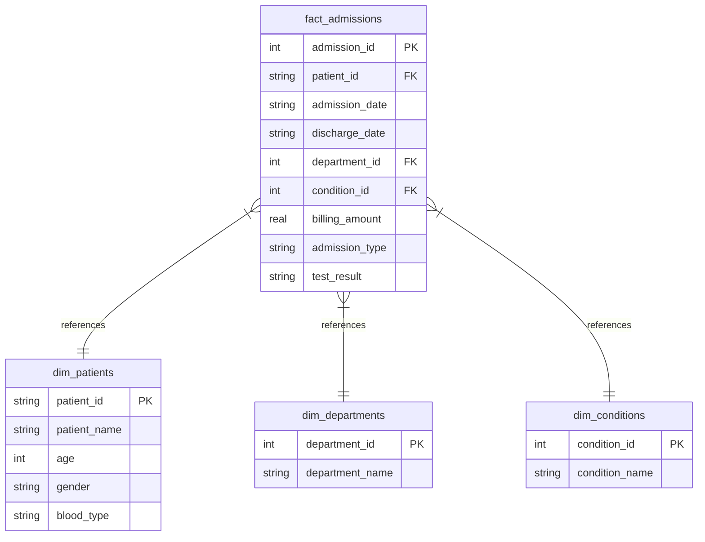

# CareMetrics — Hospital Patient Analytics & Operational Insights

An end-to-end data analytics and business intelligence platform designed to ingest, validate, and analyze patient admissions and hospital operational records. CareMetrics bridges raw data engineering (SQL star schemas, Python ETL) with visual storytelling (multi-page Streamlit dashboards, Plotly charts) to deliver actionable operational insights.

👉 **[Live Web Application Link](https://share.streamlit.io/monisa-analyst/hospital-patient-analytics/main/src/app.py)**


---

## 🚀 Key Features

1. **Interactive Multi-Page BI Dashboard:**
   - **Executive Summary:** Overall hospital performance KPIs (Total admissions, revenue, length of stay, readmission rates) and demographic breakdowns (age, gender, monthly trends).
   - **Department Operations:** Granular clinical performance grids utilizing advanced ranking systems.
   - **Submit Data:** Drag-and-drop CSV/Excel file upload enabling live batch additions.
   - **Audit Logs:** Full system transparency showing ingestion histories and real-time database integrity checks.

2. **Automated Ingestion & Column Mapping Engine:**
   - Detects incoming headers using **fuzzy column mapping** (e.g. mapping `full name`, `fullname`, or `patient name` automatically to `patient_name`).
   - Normalizes numeric values, parses multiple date formats, and handles missing or outlier entries.

3. **9-Point Data Quality Audit Gate:**
   - Validates all incoming batches against relational checks:
     - **Critical (Database Blockers):** Orphan Patients, Orphan Departments, Invalid Stay Durations (discharge before admission).
     - **Warning:** Future Admission Dates, Negative Billing Amounts, Null Value Checks, Patient Age Sanity (<0 or >115).
     - **Info (Strategic Alerts):** Excessive Stay Length (>90 days), Billing Outliers (>3 Standard Deviations).
   - Automatically computes a **Batch Health Score**. Batches with score `< 50%` are automatically rejected and rolled back to maintain production integrity.

4. **Advanced SQL Analytics Engine:**
   - Built on a structured **Star Schema** utilizing SQLite.
   - Uses Common Table Expressions (CTEs), Joins, and Window Functions (`RANK`, `ROW_NUMBER`) to calculate workloads and filter complex relationships.

---

## 📊 Database Architecture (Star Schema)

The database design normalizes flat admissions data into a high-performance relational structure:



---

## 💡 Advanced SQL Query Showcases

### 1. Department Utilization Ranking (Window Functions & Joins)
Calculates total admissions, average length of stay, and total revenue per department, then ranks the departments dynamically by total load:

```sql
SELECT 
    d.department_name,
    COUNT(f.admission_id) as total_admissions,
    RANK() OVER (ORDER BY COUNT(f.admission_id) DESC) as workload_rank,
    ROUND(AVG(julianday(f.discharge_date) - julianday(f.admission_date)), 1) as avg_length_of_stay,
    ROUND(SUM(f.billing_amount), 2) as total_revenue
FROM fact_admissions f
JOIN dim_departments d ON f.department_id = d.department_id
WHERE f.discharge_date IS NOT NULL
GROUP BY d.department_id
ORDER BY workload_rank;
```

### 2. Top 3 Treatable Diseases per Department (CTEs, Joins & Partitioned Window Functions)
Extracts the top 3 most common medical conditions treated in each department alongside total billing values:

```sql
WITH ConditionStats AS (
    SELECT 
        d.department_name,
        c.condition_name,
        COUNT(f.admission_id) as case_count,
        SUM(f.billing_amount) as total_revenue,
        ROW_NUMBER() OVER (PARTITION BY d.department_name ORDER BY COUNT(f.admission_id) DESC) as condition_rank
    FROM fact_admissions f
    JOIN dim_departments d ON f.department_id = d.department_id
    JOIN dim_conditions c ON f.condition_id = c.condition_id
    GROUP BY d.department_name, c.condition_name
)
SELECT department_name, condition_name, case_count, ROUND(total_revenue, 2) as total_revenue
FROM ConditionStats
WHERE condition_rank <= 3
ORDER BY department_name, case_count DESC;
```

---

## 🛠️ How to Run Locally

### 1. Prerequisites
Make sure you have **Python 3.8+** installed.

### 2. Install Dependencies
```bash
pip install -r requirements.txt
```

### 3. Generate Data & Seed Database
Initialize the database tables and load the initial 5,000 records:
```bash
python generate_data.py
python src/db_init.py
```

### 4. Run Streamlit Application
```bash
streamlit run src/app.py
```

---

## 📬 Contact & Connections

- **Author:** Monisa L.
- **Email:** [monisa.asi@gmail.com](mailto:monisa.asi@gmail.com)
- **LinkedIn:** [linkedin.com/in/monisa-l-333546366](https://www.linkedin.com/in/monisa-l-333546366)
- **GitHub Profile:** [github.com/Monisa-Analyst](https://github.com/Monisa-Analyst)
